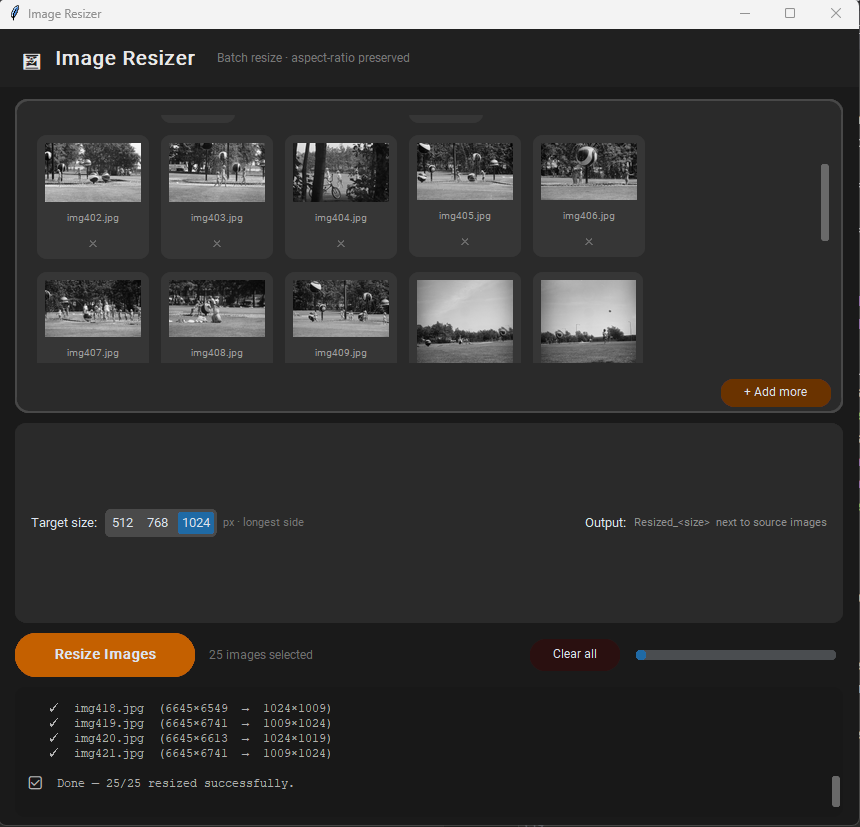

# Image Resizer

A 1-click Pinokio launcher for [Image Resizer](https://github.com/Arnold2006/Image_Resizer) — a modern dark-themed Python desktop application for batch resizing images while preserving aspect ratio.

## What the App Does

Image Resizer lets you select multiple images (by browsing or drag & drop) and resize them all to a chosen size on the longest side — 512, 768, or 1024 pixels. Output is automatically saved into a `Resized_<size>` folder created next to your source images. The originals are never modified.

After each batch completes the app resets, so you can immediately resize the same images again at a different size without re-selecting anything.

**Supported formats:** JPG, JPEG, PNG, BMP, GIF, TIFF, WebP

## Features

- 🌑 **Modern dark UI** built with CustomTkinter
- 🖼 **Image previews** — selected files appear as thumbnail cards in a scrollable grid
- ⬆ **Drag & drop** — drop images straight onto the window (powered by tkinterdnd2)
- 🗂 **Auto output folder** — `Resized_<size>` is created next to your source files automatically
- 🔁 **Re-run ready** — after resizing, the app resets so you can pick a new size and go again
- 📊 **Live progress** — progress bar and counter update as each image is processed
- ✕ **Per-image removal** — remove individual images from the queue before resizing
- 🎨 **High quality** — Lanczos resampling, quality 95 output

## How to Use

### Installation
1. Install [Pinokio](https://pinokio.computer/) if you haven't already.
2. In Pinokio, click **Download** and paste this repository URL.
3. Click **Install** — this clones the app and sets up the Python environment automatically.

### Running
1. Click **Start** in the Pinokio sidebar. The desktop app window will open.
2. **Select images** — drag & drop files onto the drop zone, or click **Browse Files**.
3. **Choose a target size** — 512, 768, or 1024 px — using the segmented button.
4. Click **Resize Images**.
5. A `Resized_<size>` folder is created next to your source images and files are saved there.
6. Once done, the app resets — switch size and click **Resize Images** again if needed.

### Output naming
Resized files are saved as `<original_name>_resized.<ext>` inside the auto-created folder.

| Original | Target | Output dimensions |
|---|---|---|
| 1920 × 1080 | 1024 px | 1024 × 576 |
| 800 × 1200 | 1024 px | 683 × 1024 |
| 512 × 512 | 768 px | 768 × 768 |

## Launcher File Overview

| File | Purpose |
|---|---|
| `install.js` | Clones the app repo and installs dependencies into a venv |
| `start.js` | Launches `app.py` inside the venv |
| `update.js` | Pulls the latest changes for both the launcher and the app |
| `reset.js` | Deletes the `app/` folder to restore a clean state |
| `link.js` | Deduplicates library files to save disk space |
| `pinokio.js` | Builds the dynamic Pinokio sidebar UI |
| `pinokio.json` | App metadata (title, description, icon) |

## Requirements

- Python 3.7+
- [Pillow](https://python-pillow.org/) — image processing
- [CustomTkinter](https://github.com/TomSchimansky/CustomTkinter) — modern dark UI
- [tkinterdnd2](https://github.com/pmgagne/tkinterdnd2) — drag & drop support

All dependencies are installed automatically by the Pinokio launcher.

## API / Programmatic Access

This app is a local desktop GUI and does not expose an HTTP server. To use the same resize logic programmatically:

